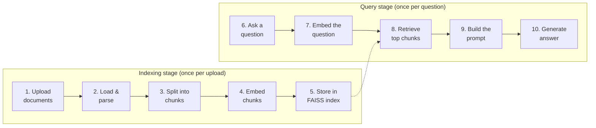
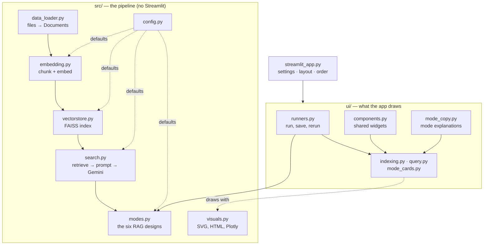

# 🔍 RAG Pipeline Explorer

An interactive, step-by-step visual guide to **Retrieval-Augmented Generation (RAG)**. Upload your
own documents, ask questions about them, and watch every stage of the pipeline happen live, from
raw files to a cited answer.

Most RAG demos hide the pipeline behind a single "Ask" button. This one shows every intermediate
result: the parsed text, the chunk boundaries, the embedding vectors, the FAISS index, which chunks
were retrieved and why, and the exact prompt sent to the model.

Everything runs on **free tiers**:

| Component | Tool | Cost |
|---|---|---|
| Embeddings | [`sentence-transformers`](https://www.sbert.net/) (`all-MiniLM-L6-v2`), runs locally on CPU | Free |
| Vector store | [FAISS](https://github.com/facebookresearch/faiss), in memory / on local disk | Free |
| Answer generation | [Google Gemini](https://ai.google.dev/) (`gemini-flash-latest`) | Free API tier |
| Orchestration | [LangChain](https://www.langchain.com/) loaders and text splitters | Free |
| UI | [Streamlit](https://streamlit.io/) + [Plotly](https://plotly.com/python/) | Free |

---

## Contents

- [What is RAG?](#what-is-rag)
- [The 10 steps the app visualizes](#the-10-steps-the-app-visualizes)
- [RAG modes](#rag-modes)
  - [Which mode to use when](#which-mode-to-use-when)
- [Getting started](#getting-started)
  - [Prerequisites](#prerequisites)
  - [1. Clone and install](#1-clone-and-install)
  - [2. Add your API key](#2-add-your-api-key)
  - [3. Run the web app](#3-run-the-web-app)
- [Command-line example](#command-line-example)
- [Using the pipeline in your own code](#using-the-pipeline-in-your-own-code)
- [Project structure](#project-structure)
  - [What each file does](#what-each-file-does)
  - [How the modules fit together](#how-the-modules-fit-together)
- [Configuration](#configuration)
- [Running the tests](#running-the-tests)
- [Troubleshooting](#troubleshooting)
- [The `archive/` folder](#the-archive-folder)

---

## What is RAG?

An LLM only knows what it was trained on. RAG lets it answer questions about **your** documents
without retraining. It works in two stages:

1. **Indexing (once per upload):** split your documents into small chunks, turn each chunk into an
   embedding (a vector of numbers that captures its meaning), and store those vectors in a
   searchable index.
2. **Querying (once per question):** embed the question the same way, find the chunks whose vectors
   are closest to it, and give only those chunks to the LLM as context for its answer.

The answer is grounded in your text, and the model is told to say "I don't know" when the answer
isn't in the retrieved chunks.

## The 10 steps the app visualizes



| # | Step | What you see in the app |
|---|---|---|
| 1 | **Upload documents** | Drag in up to 5 files (PDF, TXT, MD, CSV, DOCX, XLSX, JSON) |
| 2 | **Load & parse** | The plain text extracted from each file (e.g. one piece per PDF page) |
| 3 | **Split into chunks** | Chunks per file, and the overlap between neighboring chunks highlighted |
| 4 | **Embed chunks** | A chunk's 384-number embedding as numbers and as a bar chart, plus three ways to see which chunks are close in meaning: a 2D map, a rotatable 3D map (both PCA, with the share of variance each keeps), or a plain nearest-neighbors list |
| 5 | **Store in FAISS** | What the index stores, row by row, and how it's organized |
| 6 | **Ask a question** | A question box, with an option to also ask Gemini *without* your documents |
| 7 | **Embed the question** | The question's embedding, made with the same model as the chunks |
| 8 | **Retrieve top chunks** | Where the question and the retrieved chunks sit on the 2D or 3D map, and a ranked list with cosine similarity scores. Chunks below the minimum similarity are shown but not sent |
| 9 | **Build the prompt** | The exact prompt sent to Gemini, with each retrieved chunk color-coded to match its rank |
| 10 | **Generate answer** | Gemini's answer with `[#1]`-style citations and a **grounding score**; optionally side by side with the no-documents answer |

A live flowchart at the top of the page lights up each step as it runs. The same rank colors link
the retrieval map, the ranked list, and the colored prompt, so you can follow any chunk from the
map to the prompt and into the answer.

**Minimum similarity:** retrieved chunks scoring below this threshold (default 0.25) are not sent to
Gemini, so loosely related text doesn't dilute the prompt. If nothing passes, the app says so instead
of asking Gemini to answer from nothing.

**Grounding score:** the average cosine similarity between your question and the chunks the answer
actually cites (or every chunk sent, if the answer cites none). A low score is a hint that your
documents may not contain a good answer. It is not a measure of factual correctness.

**With vs. without your documents:** tick the comparison box to see the same question answered by
Gemini with no retrieved context. The difference between the two answers is the point of RAG.

## RAG modes

The query stage has a mode menu. Every mode answers from the same indexed documents, explains its own
numbered steps, and uses only local tools plus Gemini. No other paid service is involved.

| Mode | What's different from classic RAG | Extra Gemini calls |
|---|---|---|
| **Classic RAG** (default) | The baseline: vector search → prompt → answer | none |
| **Agentic RAG** | A Gemini "router" first decides whether the documents are needed, and skips retrieval when they aren't. A small diagram highlights the path taken | +1 (router) |
| **Vectorless RAG** | No embeddings or FAISS. The app builds an outline (headings, or each paragraph's first sentence), Gemini picks the relevant sections, and their text becomes the context | +1 (section picker) |
| **Keyword vs. vector search** | Runs local TF-IDF keyword search and vector search side by side, shows where they differ, flags question words found in no chunk (often typos), and answers from the keyword results | none |
| **RAG evaluation** | Classic RAG, then Gemini grades the answer (LLM-as-a-judge): Correct, Relevant, Grounded, Chunks relevant, each 1–5 with a reason | +1 (judge) |
| **Compare modes** | Runs one question through 2–4 modes and shows answers, sources and quality scores side by side, with a summary table | one run per mode, each graded |

The app shows this same comparison in step 6, under **Compare all six modes**, with each mode's
workflow — it's there before you upload anything, so you can read the designs first. Picking a mode
then opens **"What <mode> does, and when to use it"**, which numbers its steps, says what each one
does, and lists when it fits and when it doesn't.

Each mode numbers its own steps from 7, continuing the indexing stage, so the numbers match the
section headers you scroll through in that mode. They're left out of the comparison table above,
where six independent numberings side by side would suggest step 8 means the same thing in each.

### Which mode to use when

| Mode | Reach for it when | Avoid it when |
|---|---|---|
| **Classic RAG** | A normal question whose answer is in your documents; you want the fastest, cheapest answer, or a baseline to compare against | You need to know how good the answer is, or most questions aren't about the documents at all |
| **Agentic RAG** | Mixed conversations, where some questions need the documents and some don't — greetings and general knowledge skip the search entirely | Every question is about your documents: the router then costs an extra request on each one and changes nothing |
| **Vectorless RAG** | Documents with real headings (reports, manuals, contracts); the answer sits in one clearly-titled section; you want retrieval with no vector database at all | Long, unstructured documents whose headings don't describe what's under them — Gemini only ever sees the outline, so anything it doesn't hint at is invisible |
| **Keyword vs. vector search** | Working out why a search missed; questions with exact names, codes or rare words; deciding whether you need hybrid search | You just want the best answer — it answers from the keyword hits alone, to show that search on its own. It's a diagnostic view |
| **RAG evaluation** | Checking quality before you trust a setup; comparing chunk size, `top_k` or minimum similarity with a score rather than a hunch | Everyday questions: it doubles the cost of every one |
| **Compare modes** | Deciding which design suits your documents; a demo or write-up that needs to show the difference | Everyday use — it's by far the most expensive mode |

The **Show quality scores** toggle adds the judge's four scores to any mode's answer (one extra call).

Two things worth knowing before you trust the numbers. The judge only sees the retrieved text, so
"Correct" means "matches the retrieved text", and a model grading an AI answer tends to be generous.
And **Compare modes** runs the 2–4 modes *you pick* (not a fixed set), costing 2–3 requests each
including its judge call — so 4 to 12 requests for one question. The app shows the count before you ask.

These modes teach the ideas from the notebooks in `archive/` (LangGraph agentic RAG, PageIndex
vectorless RAG, Typesense keyword search, LangSmith evaluation) without their paid services.

---

## Getting started

### Prerequisites

- Python 3 (developed and tested on Python 3.14)
- A free Google Gemini API key from **https://aistudio.google.com/apikey** (no credit card needed)

### 1. Clone and install

```bash
git clone https://github.com/JasleenMinhas578/RAG-project.git
cd RAG-project

python3 -m venv .venv
source .venv/bin/activate        # Windows: .venv\Scripts\activate
pip install -r requirements.txt
```

Dependency versions in `requirements.txt` are pinned to a set that is known to work together.

### 2. Add your API key

Create a file named `.env` in the project root:

```bash
GOOGLE_API_KEY=your_key_here
```

`.env` is listed in `.gitignore`, so your key is never committed. The app reads the key from `.env`
only and never shows it in the browser. The sidebar just tells you whether a key was found.

### 3. Run the web app

```bash
streamlit run streamlit_app.py
```

Streamlit opens the app at http://localhost:8501. Then:

1. Upload one or more documents and click **Run indexing**.
2. Explore steps 2–5 as they appear.
3. Type a question and click **Ask** to see steps 7–10.
4. Try changing **chunk size**, **chunk overlap**, **top_k** and **minimum similarity** in the
   sidebar and re-running to see how they affect retrieval.
5. Tick **Also ask Gemini without my documents** to compare a RAG answer with the model's
   general-knowledge answer.

> **First run:** the embedding model (about 90 MB) downloads from Hugging Face the first time you
> index something. Later runs use the cached copy, and the app loads it into memory only once.

---

## Command-line example

`app.py` runs the same pipeline without the UI. It loads every supported file from a `data/`
folder, builds a FAISS index (saved to `faiss_store/` and reused on later runs), and prints an
answer to a sample question:

```bash
mkdir -p data          # put your documents in here
python app.py
```

Each module in `src/` also has its own runnable example:

```bash
python -m src.data_loader
python -m src.embedding
python -m src.vectorstore
python -m src.search
```

---

## Using the pipeline in your own code

The modules in `src/` are independent of the web app, and each step can be called on its own:

```python
from src.data_loader import load_all_documents
from src.embedding import EmbeddingPipeline
from src.vectorstore import FaissVectorStore
from src.search import RAGSearch, filter_by_similarity

docs = load_all_documents("data")                     # files -> LangChain Documents

pipeline = EmbeddingPipeline(chunk_size=500, chunk_overlap=100)
chunks = pipeline.chunk_documents(docs)               # Documents -> chunks
embeddings = pipeline.embed_chunks(chunks)            # chunks -> vectors

store = FaissVectorStore()
store.add_embeddings(
    embeddings.astype("float32"),                     # FAISS expects float32
    [{"text": c.page_content, "source": c.metadata.get("source", "unknown")} for c in chunks],
)

rag = RAGSearch(vectorstore=store)                    # reads GOOGLE_API_KEY from the environment
results = rag.retrieve("What is this document about?", top_k=4)
kept, dropped = filter_by_similarity(results, 0.25)   # leave out weak matches
prompt = rag.build_prompt("What is this document about?", kept)
print(rag.generate_answer(prompt))
```

`rag.search_and_summarize(query)` chains retrieval, the similarity filter, prompt building and
generation into one call.

The modules log with Python's `logging` module instead of printing. Call
`logging.basicConfig(level=logging.INFO)` to see what each step is doing.

---

## Project structure

```
RAG-project/
├── streamlit_app.py          the page
├── ui/                       what the app draws
│   ├── components.py
│   ├── mode_copy.py
│   ├── runners.py
│   ├── indexing.py
│   ├── query.py
│   └── mode_cards.py
├── src/                      the pipeline, with no web app
│   ├── config.py
│   ├── data_loader.py
│   ├── embedding.py
│   ├── vectorstore.py
│   ├── search.py
│   ├── modes.py
│   └── visuals.py
├── app.py                    CLI example
├── tests/                    pytest suite
├── archive/                  older standalone notebooks
├── .streamlit/config.toml
├── requirements.txt
├── requirements-dev.txt
├── pyproject.toml
├── pytest.ini
└── CLAUDE.md
```

Every file is described below.

### What each file does

**The app** — `src/` is the pipeline and never imports Streamlit; `ui/` is everything drawn on top of it.

| File | What it does | Change it when you want to |
|---|---|---|
| `streamlit_app.py` | The page itself: session-state defaults, the sidebar, the layout, and the order the sections appear in | Add a sidebar setting, or move a section |
| `ui/components.py` | The widgets every section reuses: stage banners, step headers, inline definitions, text boxes, and the shared answer, prompt and score cards | Add something more than one section needs |
| `ui/mode_copy.py` | What each RAG mode is, its steps, when it fits and when it doesn't, plus the six-mode comparison table | Reword a mode, or add one |
| `ui/runners.py` | Does the work: runs a stage, shows live progress, saves every result to session state, then reruns | Change what gets computed or stored |
| `ui/indexing.py` | The indexing stage, steps 1 to 5 | Change how upload → index is presented |
| `ui/query.py` | Classic RAG, steps 7 to 11 | Change how a classic answer is presented |
| `ui/mode_cards.py` | The cards for agentic, vectorless, keyword and compare modes | Change how a non-classic mode explains itself |

**The pipeline** — importable on its own, with no web app (see [Using the pipeline in your own code](#using-the-pipeline-in-your-own-code)).

| File | What it does | Change it when you want to |
|---|---|---|
| `src/config.py` | Every limit and default in one place: upload caps, chunk size and overlap, `top_k`, the minimum similarity, model names, retry count | Tune anything — change it here, not inline |
| `src/data_loader.py` | Loads PDF, TXT, MD, CSV, XLSX, DOCX and JSON into LangChain Documents, skipping files it can't parse | Support a new file type |
| `src/embedding.py` | Splits documents into chunks and embeds them locally; the model is loaded once and shared | Change chunking, or the embedding model |
| `src/vectorstore.py` | The FAISS index: add, search, save and load, plus cosine similarity and the settings check on load | Change how vectors are stored or searched |
| `src/search.py` | `RAGSearch`: retrieve → filter → build the prompt → generate. Also the prompt template, citation parsing, the grounding score and the plain-English Gemini errors | Change the prompt, or an error message |
| `src/modes.py` | The alternative RAG designs and their Gemini prompts: agentic routing, vectorless outlines, TF-IDF keyword search, and the LLM-as-a-judge scoring | Add a RAG design, or tune a mode's prompt |
| `src/visuals.py` | All drawing that needs no Streamlit: the colour palette, the CSS block, the flowchart SVG, the HTML snippets and the Plotly figures | Change how anything looks |

**Project files**

| File | What it does |
|---|---|
| `app.py` | Minimal CLI example: build or load a FAISS index from `data/` and ask one question |
| `tests/` | The pytest suite, one file per `src/` module plus a smoke test that the page renders |
| `.streamlit/config.toml` | Streamlit settings: file watcher off (see [Troubleshooting](#troubleshooting)), telemetry off |
| `requirements.txt` | Pinned runtime dependencies, including the transitive `torch` and `transformers` |
| `requirements-dev.txt` | The above plus `pytest` and `ruff` |
| `pyproject.toml` | Ruff lint configuration |
| `archive/` | Earlier standalone tutorial notebooks, kept for reference and not used by the app |
| `CLAUDE.md` | Detailed architecture notes for working on the code |

### How the modules fit together

`src/` is the pipeline and knows nothing about Streamlit, which is what lets you import it into your
own code. `ui/` is everything the app draws, and sits on top of it.



---

## Configuration

All limits and defaults live in [`src/config.py`](src/config.py):

| Setting | Default | Purpose |
|---|---|---|
| `MAX_FILES` | `5` | Max files per upload |
| `MAX_TOTAL_MB` | `10` | Max total upload size |
| `MAX_CHUNKS` | `500` | Max chunks to embed (keeps CPU embedding fast) |
| `DEFAULT_CHUNK_SIZE` | `500` | Characters per chunk |
| `DEFAULT_CHUNK_OVERLAP` | `100` | Characters shared between neighboring chunks |
| `DEFAULT_EMBEDDING_MODEL` | `all-MiniLM-L6-v2` | Local sentence-transformers model (384 dimensions) |
| `VECTOR_PREVIEW_DIMS` | `12` | How many numbers of a vector the app prints as a sample |
| `DEFAULT_TOP_K` | `4` | Chunks retrieved per question |
| `DEFAULT_MIN_SIMILARITY` | `0.25` | Retrieved chunks below this cosine similarity are not sent to Gemini |
| `DEFAULT_GEMINI_MODEL` | `gemini-flash-latest` | Gemini model; the `-latest` alias survives model retirements |
| `GEMINI_MAX_RETRIES` | `2` | Attempts before a Gemini error is shown (the SDK default of 6 makes quota errors hang) |

These limits keep the demo fast on a laptop and within Gemini's free-tier quota. Each question
costs one Gemini call, or two if you turn on the with/without-documents comparison.

> If you change the embedding model, rebuild the index. Queries must be embedded with the same
> model that built the index. A saved index records the model it was built with, so loading one
> built by a different model logs a warning — it still loads, but its answers will be wrong.

---

## Running the tests

```bash
pip install -r requirements-dev.txt
pytest
ruff check .        # lint: unused imports, undefined names, import order, likely bugs
```

The tests cover the pipeline logic (cosine similarity, chunking, the similarity filter, citation
parsing and the grounding score, error messages), the rendering helpers (the prompt view shows
exactly the text sent to Gemini, and document text is escaped), and a smoke test that the app page
renders. They don't call the Gemini API and don't download the embedding model.

---

## Troubleshooting

| Problem | Fix |
|---|---|
| Sidebar says **No GOOGLE_API_KEY found** | Create `.env` with `GOOGLE_API_KEY=...` in the project root, then restart Streamlit |
| Code changes don't show up in the app | Hot reload is off on purpose (see below). Stop and rerun `streamlit run streamlit_app.py` |
| Gemini returns a model-not-found error | Google retired the model. Set `DEFAULT_GEMINI_MODEL` in `src/config.py` to a current model |
| **Gemini's free-tier limit was reached** | A per-minute limit: wait about a minute and ask again. Turning off extra calls (comparison, quality scores, Compare modes) uses fewer requests |
| **You've reached today's free-tier limit for this Gemini model** | The free tier also caps requests per day, per model (20 a day for `gemini-flash-latest` when this was written). Try again tomorrow, or set `DEFAULT_GEMINI_MODEL` in `src/config.py` to another model, which has its own daily limit |
| **None of the retrieved chunks reached the minimum similarity** | Rephrase the question, or lower **Minimum similarity** in the sidebar |
| A file fails to load | It's skipped with a warning in the terminal, so the other files still load |
| Deployed app shows **`ImportError: cannot import name ...`** right after a push | A stale worker on Streamlit Community Cloud, not a code bug. It pulls the new code and re-runs `streamlit_app.py`, but modules already in `sys.modules` (anything under `src/` or `ui/`) are not re-imported, so a newly added name appears missing. **Manage app → Reboot** fixes it. The traceback can be doubly confusing because it renders the old source next to the new error |

**Deploying:** pushes to `main` redeploy the Streamlit Community Cloud app automatically, but only a
change to `requirements.txt` forces a full environment rebuild. A push that just changes Python files
re-runs the entry script in the existing process, so reboot the app from its **Manage app** menu after
any change that adds a new name to a module — see the `ImportError` row above.

**Why hot reload is off:** `.streamlit/config.toml` sets `fileWatcherType = "none"`. With the
watcher on, Streamlit scans the `transformers` package and floods the terminal with harmless
`No module named 'torchvision'` tracebacks.

---

## The `archive/` folder

Earlier standalone tutorial notebooks, kept for reference. They are independent of `src/` and of
each other, and aren't used by the app:

- LangSmith RAG evaluation
- PageIndex "vectorless" RAG
- Typesense search
- LangGraph agentic RAG
- Basic LangChain document and PDF loading

Some notebooks use other services (OpenAI, Groq, LangSmith, PageIndex, Typesense) and expect their
own API keys in environment variables.
